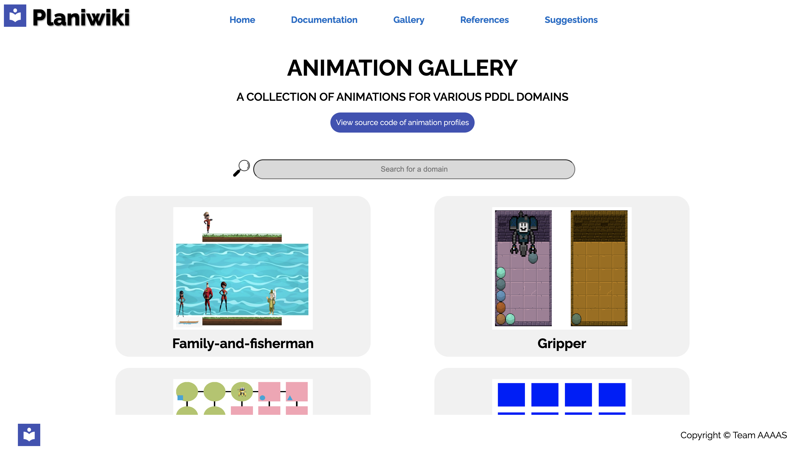

# Documentation

Full documentation available here: [http://planimation.github.io/documentation](http://planimation.github.io/documentation)


## Overview

Watch the video below for a 2 minutes introduction about Planimation.

[](https://youtu.be/Cj2rWdt1YQU)


## Getting Started

1. Try planimation within the [online PDDL editor](https://tinyurl.com/yxlt96fp). Comes preloaded with files to planimat Blocks. Planimation is installable from the plugin menu. 

2. Alternatively, visit our stand alone application at [http://planimation.planning.domains](http://planimation.planning.domains), or explore the [gallery](http://planikiwi.planning.domains/) with the existing planimated domains.



<br>


For developer documentation, see

1. [Animation Profile Guide](https://planimation.github.io/documentation/ap_guide/)
    * Contains a guide to Animation Profiles and the Animation Profile Language
2. [Backend Dev. Guide](https://planimation.github.io/documentation/VFG_guide/)
    * Contains a guide to the Visualisation File Generator Component
3. [Frontend Dev. Guide](https://planimation.github.io/documentation/Visualiser_guide/)
    * Contains a guide to the VisualiserComponent 

## Papers

- [ICAPS 2019 System Demonstrations](https://arxiv.org/pdf/2008.04600.pdf)

- [KEPS book: Plannimg.domains](https://link.springer.com/chapter/10.1007/978-3-030-38561-3_5#readcube-epdf)


## Citing Planimation

Please cite Planimation using
``` latex
@article{chen2020planimation,
  author       = {Chen, Gan and
                  Ding, Yi and
                  Edwards, Hugo and
                  Chau, Chong Hin and
                  Hou, Sai and
                  Johnson, Grace and
                  Sharukh Syed, Mohammed and
                  Tang, Haoyuan and
                  Wu, Yue and
                  Yan, Ye and
                  Tidhar Gil and
                  Lipovetzky Nir},
  title        = {Planimation},
  journal      = {arXiv preprint arXiv:2008.04600},
  year         = {2020}
}
```
